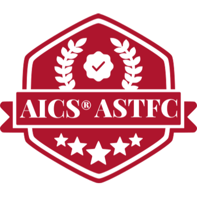

<h1 align="center">Olá, seja bem vindo ao meu perfil!</h1>
<h3 align="center">Sou Wellington! Muito prazer 👋</h3>

 

 
Profissional da área de QA, com conhecimetos na área de testes de software

Formado em análise e desenvolvimento de Sistemas e pós-graduação em Desenvolvimento, Engenharia de Software - ênfase em Qualidade e Testes e UX.

As minhas Soft Skills incluem ser colaborativo, comunicativo, determinado, trabalho em equipa e Compromisso.

Quanto às minhas competências técnicas para testes de software, tenho experiência em testes manuais e automatizados de APIs com Postman e Newman, SWAGGER, testes de performance com Jmeter, além de conhecimentos em automação de testes web e mobile utilizando ferramentas Selenium com Junit, Appium e Cypress.

Para o desenvolvimento, tenho conhecimentos em Java, Javascript, base de dados SQL, WordPress, Node, HTML5 e CSS3.

Quanto a habilidades de CI/CD utilizo ferramentas como Azure Pipeline, Jenkins, GitLab, Azure Test Plan, Git Actions, Github e Docker.

Também conheço metodologias ágeis como Scrum, Kanban e XP, e ferramentas de gestão de projectos como AzureDevOps, Jira, Trello.

Tenho certificações relevantes, incluindo Postman API, Scrum (SFPC), Kanban (KEPC), DevOps (DEPCP), Gitlab e LGPD (LGPDF).

- 👨🏽‍💻 Atualmente trabalhando como QA Tester.
- 📚 Me desenvolvendo em testes de software e automação de testes, bem como testes de API e Performance.
- 💬 Pergunte-me sobre testes de software.
- 🤔 Curiosidade: Gosto de Desporto, Filmes e Séries;
- 📝 Meu [Currículo](https://1drv.ms/b/s!AkausQumNj7-gsAGeI14e9rW0pCYqA?e=C8sCxL) em PDF

<h3 align="left">Como me contactar</h3>

  

  

        <h3 align="left">Certificações:</h3>
        
        
        
        
        
        
        <a href="https://www.credly.com/badges/6886ad6e-587c-42c7-b768-4987e79f8315" target="_blank">
            
        
    

  

        <h3 align="left">Estou aprendendo sobre:</h3>
        
         
        
        
        
        
        
        
        
        
    

    

        <h3 align="left">Ferramentas que uso:</h3>  
        
        
        
        
        
        
        
        
        
        
        
        
        
        
        
        
        
    

 
 

  
    
  

